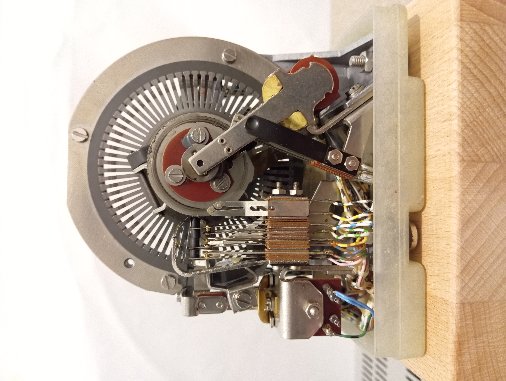
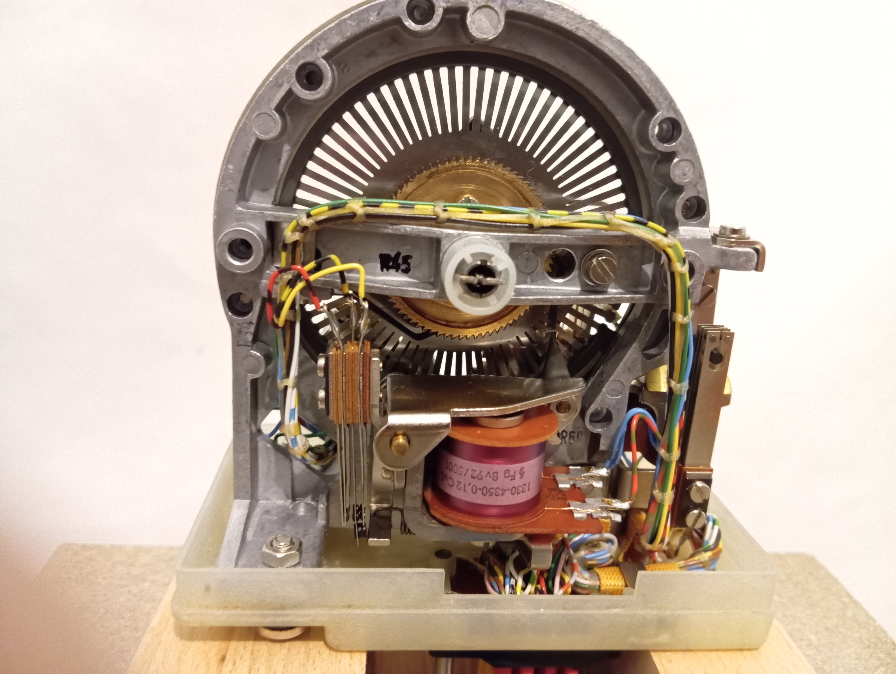

# Siemens M Pulse Repeater Interface
# Interfaccia per Ripetitore di Impulsi Siemens M

[English](#english) | [Italiano](#italiano)

---


*Front view of the Siemens M pulse repeater*


*Rear view showing relays and connections*

---


## English

### Overview
This project documents and provides an interface for the Siemens pulse repeater used in "M System" automatic telephone exchanges. The pulse repeater is an electromechanical memory device that served as a temporary register to store telephone number digits in the form of consecutive pulse trains.

This repository includes:
- Complete pinout mapping and functional logic documentation
- Arduino interface for controlling inputs and reading outputs
- Educational demonstrator using numeric keypad input and display output
- Historical documentation and photographs

### Historical Context
The Siemens pulse repeater was introduced in Italian automatic telephone exchanges (SIP) in 1957 and remained in service until approximately 1975, when electronic exchanges began to replace electromechanical systems. 

This device can be considered an electromechanical FIFO memory or circular shift register. Its ingenious construction uses a rotating metal disk divided into thin lamellae, each capable of two stable positions (comparable to 0 and 1): "behind" or "in front of" a ring-shaped track with a reading contact.

Similar electromechanical memories were used in early computers such as the IBM 602 (1946-48) and the IBM 421 tabulator (1950).

### Project Structure
```
.
├── docs/                    # Documentation and datasheets
│   └── historical/         # Historical documents and references
├── technic/                 # Technical documentation
│   ├── pinout/             # Pin mapping and connections
│   └── components/         # Memory components
├── photos/                  # Photographs of the device
├── arduino/                 # Arduino interface code
│   ├── examples/           # Example sketches
│   └── libraries/          # Custom libraries
└── README.md
```

### Hardware Requirements
- Siemens M Pulse Repeater
- Arduino M0 (or compatible boards: Uno, Mega, Nano, etc.)
- Numeric keypad (input device)
- Display (TBD - output device)
- Interface components (relays, drivers, optoisolators - see hardware documentation)
- Power supply (appropriate voltage for the pulse repeater)

### Current Status
- ✅ Reverse engineering completed
- ✅ Pinout and functional logic documented
- 🔄 Arduino interface testing in progress
- ⏳ Input/output devices integration (planned)
- ⏳ Educational demonstrator assembly (planned)

### Getting Started
_(Documentation will be added as the project progresses)_

1. Review the pinout documentation in `/technic/pinout/`
2. Check the interface schematics in `/technic/components/`
3. Upload the Arduino sketch from `/arduino/examples/`
4. Connect the hardware according to the wiring diagram
5. Test with the provided examples

### Educational Demonstrator
The final goal is to create an educational demonstrator where:
- **Input:** Data is entered via numeric keypad (simulating telephone dialing)
- **Memory:** The pulse repeater stores the digit sequence
- **Output:** The stored data is displayed on an output device

This demonstrates the working principle of electromechanical memories used in mid-20th century telecommunications.

### Contributing
Contributions are welcome! This project aims to preserve and document historical telecommunications technology. Feel free to:
- Submit improvements to documentation
- Share additional historical information or photographs
- Propose interface enhancements
- Report issues or suggest features

### License
This project is released under an open-source license (TBD).

### References
- Foddis, *Corso teorico-pratico di Telefonia*, 2nd ed., Hoepli, 1972 (pp. 150+)
- Luceri, *Il telefono*, Editoriale Delfino, 1970

### Acknowledgments
This project documents technology developed by Siemens for SIP (Società Italiana per l'Esercizio Telefonico) and used in Italian telephone exchanges from 1957 to approximately 1975.

---

## Italiano

### Panoramica
Questo progetto documenta e fornisce un'interfaccia per il ripetitore di impulsi Siemens utilizzato nelle centrali telefoniche automatiche "sistema M". Il ripetitore di impulsi è un dispositivo di memoria elettromeccanica che fungeva da registro temporaneo per memorizzare le cifre del numero telefonico sotto forma di treni di impulsi consecutivi.

Questo repository include:
- Mappatura completa dei pin e documentazione della logica funzionale
- Interfaccia Arduino per comandare gli input e leggere gli output
- Dimostratore educativo con input da tastierino numerico e output su display
- Documentazione storica e fotografie

### Contesto Storico
Il ripetitore di impulsi Siemens fu introdotto nelle centrali telefoniche automatiche italiane (SIP) nel 1957 e rimase in servizio fino al 1975 circa, quando le centrali elettroniche iniziarono a sostituire i sistemi elettromeccanici.

Questo dispositivo può essere considerato una memoria FIFO elettromeccanica o un registro circolare a scorrimento. La sua costruzione ingegnosa utilizza un disco metallico rotante suddiviso in lamelle sottili, ciascuna capace di due posizioni stabili (paragonabili a 0 e 1): "dietro" o "davanti" ad una pista di forma anulare con un contatto di lettura.

Memorie elettromeccaniche simili furono utilizzate nei primi calcolatori come l'IBM 602 (1946-48) e la tabulatrice IBM 421 (1950).

### Struttura del Progetto
```
.
├── docs/                    # Documentazione e datasheet
│   └── historical/         # Documenti storici e riferimenti
├── technic/                 # Documentazione tecnica
│   ├── pinout/             # Mappatura pin e collegamenti
│   └── components/         # Componenti della memoria
├── photos/                  # Fotografie del dispositivo
├── arduino/                 # Codice interfaccia Arduino
│   ├── examples/           # Sketch di esempio
│   └── libraries/          # Librerie personalizzate
└── README.md
```

### Requisiti Hardware
- Ripetitore di Impulsi Siemens M
- Arduino M0 (o schede compatibili: Uno, Mega, Nano, ecc.)
- Tastierino numerico (dispositivo di input)
- Display (da definire - dispositivo di output)
- Componenti di interfaccia (relè, driver, optoisolatori - vedi documentazione hardware)
- Alimentatore (tensione appropriata per il ripetitore di impulsi)

### Stato Attuale
- ✅ Reverse engineering completato
- ✅ Pinout e logica funzionale documentati
- 🔄 Test interfaccia Arduino in corso
- ⏳ Integrazione dispositivi input/output (pianificata)
- ⏳ Assemblaggio dimostratore educativo (pianificato)

### Come Iniziare
_(La documentazione verrà aggiunta man mano che il progetto progredisce)_

1. Consultare la documentazione del pinout in `/technic/pinout/`
2. Verificare gli schemi dell'interfaccia in `/technic/components/`
3. Caricare lo sketch Arduino da `/arduino/examples/`
4. Collegare l'hardware secondo lo schema di cablaggio
5. Testare con gli esempi forniti

### Dimostratore Educativo
L'obiettivo finale è creare un dimostratore educativo dove:
- **Input:** I dati vengono inseriti tramite tastierino numerico (simulando la composizione telefonica)
- **Memoria:** Il ripetitore di impulsi memorizza la sequenza di cifre
- **Output:** I dati memorizzati vengono visualizzati su un dispositivo di output

Questo dimostra il principio di funzionamento delle memorie elettromeccaniche utilizzate nelle telecomunicazioni della metà del XX secolo.

### Contribuire
I contributi sono benvenuti! Questo progetto mira a preservare e documentare la tecnologia storica delle telecomunicazioni. Sentitevi liberi di:
- Inviare miglioramenti alla documentazione
- Condividere informazioni storiche o fotografie aggiuntive
- Proporre miglioramenti all'interfaccia
- Segnalare problemi o suggerire funzionalità

### Licenza
Questo progetto è rilasciato sotto licenza open-source (da definire).

### Riferimenti
- Foddis, *Corso teorico-pratico di Telefonia*, 2a ed., Hoepli, 1972 (pag. 150 e seguenti)
- Luceri, *Il telefono*, Editoriale Delfino, 1970

### Riconoscimenti
Questo progetto documenta la tecnologia sviluppata da Siemens per la SIP (Società Italiana per l'Esercizio Telefonico) e utilizzata nelle centrali telefoniche italiane dal 1957 al 1975 circa.
