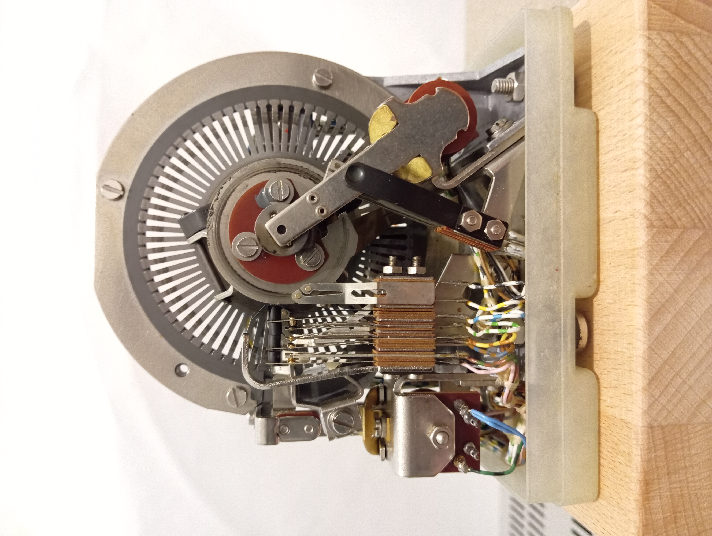
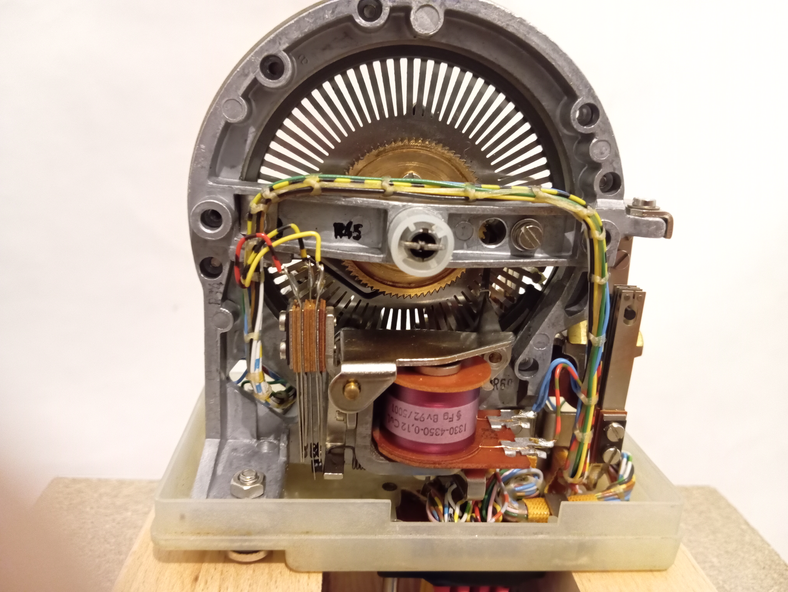

# Siemens M Pulse Repeater Interface
# Interfaccia per Ripetitore di Impulsi Siemens M

[English](#english) | [Italiano](#italiano)

---


*Front view of the Siemens M pulse repeater*


*Rear view showing relays and connections*

---


## English

### Overview
This project documents and provides an interface for the Siemens pulse repeater used in "M System" automatic telephone exchanges. The pulse repeater is an electromechanical memory device that served as a temporary register to store telephone number digits in the form of consecutive pulse trains.

This repository includes:
- Complete pinout mapping and functional logic documentation
- Arduino interface for controlling inputs and reading outputs
- Educational demonstrator using numeric keypad input and display output
- Historical documentation and photographs

### Historical Context
The Siemens pulse repeater was introduced in Italian automatic telephone exchanges (SIP) in 1957 and remained in service until approximately 1975, when electronic exchanges began to replace electromechanical systems. 

This device can be considered an electromechanical FIFO memory or circular shift register. Its ingenious construction uses a rotating metal disk divided into thin lamellae, each capable of two stable positions (comparable to 0 and 1): "behind" or "in front of" a ring-shaped track with a reading contact.

Similar electromechanical memories were used in early computers such as the IBM 602 (1946-48) and the IBM 421 tabulator (1950).

### Project Structure
```
.
├── docs/                    # Documentation and datasheets
│   └── historical/         # Historical documents and references
├── technic/                 # Technical documentation
│   ├── pinout/             # Pin mapping and connections
│   └── components/         # Memory components
├── photos/                  # Photographs of the device
├── arduino/                 # Arduino interface code
│   ├── examples/           # Example sketches
│   └── libraries/          # Custom libraries
└── README.md
```

### Hardware Requirements
- Siemens M Pulse Repeater
- Arduino M0 (or compatible boards: Uno, Mega, Nano, etc.)
- Numeric keypad (input device)
- Display (TBD - output device)
- Interface components (relays, drivers, optoisolators - see hardware documentation)
- Power supply (appropriate voltage for the pulse repeater)

---

## ⚠️ POWER SUPPLY AND SAFETY WARNING

### 🔴 CRITICAL SAFETY INFORMATION - READ BEFORE BUILDING

This system requires **TWO separate power supplies**:

#### 1. LOW VOLTAGE SECTION (5V DC)
- Arduino board
- LCD2004 display
- MCP23017 I2C expander
- Digital signal lines
- Control circuitry

#### 2. HIGH VOLTAGE SECTION (48V DC)
- Relay coils
- Mechanical memory actuation system
- Motor drives

### ELECTRICAL ISOLATION

The 5V and 48V sections **MUST** be electrically isolated:
- Relays provide optical or magnetic isolation between sections
- Arduino controls relay coils (low voltage side)
- Relay contacts switch high voltage power
- **NEVER** connect 48V directly to Arduino pins
- Use optocouplers or relay modules with built-in isolation

### WIRING REQUIREMENTS
- Use appropriate wire gauge for 48V current levels
- Ensure proper insulation on all 48V connections
- Keep 48V wiring separate from 5V signal wiring
- Use terminal blocks or connectors rated for 48V
- Implement proper grounding for safety

---

## ⚡ DANGER - HIGH VOLTAGE WARNING

### 48V DC CAN BE LETHAL UNDER CERTAIN CONDITIONS

- 48V DC can cause electrical shock and serious injury
- Risk increases with wet conditions or broken skin
- Can cause burns, muscle contractions, and cardiac effects
- Always disconnect power before handling circuits
- Use insulated tools when working with live circuits
- Never work on circuits while powered
- Ensure all connections are properly insulated
- Keep work area dry

---

## 📜 DISCLAIMER

**The author(s) of this project DISCLAIM ALL RESPONSIBILITY and LIABILITY for any injury, death, property damage, or other consequences resulting from the construction, modification, or use of this system.**

By building or using this project, you acknowledge that:
- ✓ You understand the risks involved with high voltage systems
- ✓ You have the necessary skills and knowledge to work safely
- ✓ You accept full responsibility for your safety and others
- ✓ You will comply with all local electrical codes and regulations
- ✓ You use this information entirely at your own risk

### ⛔ IF YOU ARE NOT QUALIFIED TO WORK WITH HIGH VOLTAGE SYSTEMS, DO NOT ATTEMPT TO BUILD THIS PROJECT.

Consult a qualified electrician or engineer if you have any doubts about electrical safety or proper construction techniques.

---

## 🛡️ RECOMMENDED SAFETY PRACTICES

1. **ALWAYS** disconnect power before touching any part of the circuit
2. Use a multimeter to verify circuits are de-energized
3. Wait for capacitors to discharge before handling
4. Implement emergency stop switch (easily accessible)
5. Use proper enclosure to prevent accidental contact
6. Label all high voltage sections clearly
7. Use appropriate personal protective equipment (PPE)
8. Never bypass safety interlocks or fuses
9. Keep flammable materials away from electrical components
10. Have fire extinguisher suitable for electrical fires nearby

### COMPONENT RATINGS
- Verify current ratings exceed maximum load
- Use fuses or circuit breakers for overcurrent protection
- Select wire gauge appropriate for current and voltage
- Use connectors and terminals rated for the application

### TESTING PROCEDURE
1. Inspect all connections before applying power
2. Test 5V section first (Arduino and logic circuits)
3. With 48V disconnected, verify relay operation (clicking sound)
4. Connect 48V with load disconnected
5. Measure voltages at all test points
6. Connect load only after verifying all safety checks
7. Monitor system during initial operation

### LOCAL REGULATIONS
- Check local electrical codes and regulations
- Some jurisdictions may require certified installation
- Building permits may be required
- Industrial safety standards may apply (OSHA, IEC, etc.)
- Comply with all applicable laws and standards

---

### Current Status
- ✅ Reverse engineering completed
- ✅ Pinout and functional logic documented
- 🔄 Arduino interface testing in progress
- ⏳ Input/output devices integration (planned)
- ⏳ Educational demonstrator assembly (planned)

### Getting Started
_(Documentation will be added as the project progresses)_

1. Review the pinout documentation in `/technic/pinout/`
2. Check the interface schematics in `/technic/components/`
3. Upload the Arduino sketch from `/arduino/examples/`
4. Connect the hardware according to the wiring diagram
5. Test with the provided examples

### Educational Demonstrator
The final goal is to create an educational demonstrator where:
- **Input:** Data is entered via numeric keypad (simulating telephone dialing)
- **Memory:** The pulse repeater stores the digit sequence
- **Output:** The stored data is displayed on an output device

This demonstrates the working principle of electromechanical memories used in mid-20th century telecommunications.

### Contributing
Contributions are welcome! This project aims to preserve and document historical telecommunications technology. Feel free to:
- Submit improvements to documentation
- Share additional historical information or photographs
- Propose interface enhancements
- Report issues or suggest features

### License
This project is released under an open-source license (TBD).

### References
- Foddis, *Corso teorico-pratico di Telefonia*, 2nd ed., Hoepli, 1972 (pp. 150+)
- Luceri, *Il telefono*, Editoriale Delfino, 1970

### Acknowledgments
This project documents technology developed by Siemens for SIP (Società Italiana per l'Esercizio Telefonico) and used in Italian telephone exchanges from 1957 to approximately 1975.

---

## Italiano

### Panoramica
Questo progetto documenta e fornisce un'interfaccia per il ripetitore di impulsi Siemens utilizzato nelle centrali telefoniche automatiche "sistema M". Il ripetitore di impulsi è un dispositivo di memoria elettromeccanica che fungeva da registro temporaneo per memorizzare le cifre del numero telefonico sotto forma di treni di impulsi consecutivi.

Questo repository include:
- Mappatura completa dei pin e documentazione della logica funzionale
- Interfaccia Arduino per comandare gli input e leggere gli output
- Dimostratore educativo con input da tastierino numerico e output su display
- Documentazione storica e fotografie

### Contesto Storico
Il ripetitore di impulsi Siemens fu introdotto nelle centrali telefoniche automatiche italiane (SIP) nel 1957 e rimase in servizio fino al 1975 circa, quando le centrali elettroniche iniziarono a sostituire i sistemi elettromeccanici.

Questo dispositivo può essere considerato una memoria FIFO elettromeccanica o un registro circolare a scorrimento. La sua costruzione ingegnosa utilizza un disco metallico rotante suddiviso in lamelle sottili, ciascuna capace di due posizioni stabili (paragonabili a 0 e 1): "dietro" o "davanti" ad una pista di forma anulare con un contatto di lettura.

Memorie elettromeccaniche simili furono utilizzate nei primi calcolatori come l'IBM 602 (1946-48) e la tabulatrice IBM 421 (1950).

### Struttura del Progetto
```
.
├── docs/                    # Documentazione e datasheet
│   └── historical/         # Documenti storici e riferimenti
├── technic/                 # Documentazione tecnica
│   ├── pinout/             # Mappatura pin e collegamenti
│   └── components/         # Componenti della memoria
├── photos/                  # Fotografie del dispositivo
├── arduino/                 # Codice interfaccia Arduino
│   ├── examples/           # Sketch di esempio
│   └── libraries/          # Librerie personalizzate
└── README.md
```

### Requisiti Hardware
- Ripetitore di Impulsi Siemens M
- Arduino M0 (o schede compatibili: Uno, Mega, Nano, ecc.)
- Tastierino numerico (dispositivo di input)
- Display (da definire - dispositivo di output)
- Componenti di interfaccia (relè, driver, optoisolatori - vedi documentazione hardware)
- Alimentatore (tensione appropriata per il ripetitore di impulsi)

---

## ⚠️ ALIMENTAZIONE E AVVISO DI SICUREZZA

### 🔴 INFORMAZIONI CRITICHE DI SICUREZZA - LEGGERE PRIMA DI COSTRUIRE

Questo sistema richiede **DUE alimentazioni separate**:

#### 1. SEZIONE A BASSA TENSIONE (5V DC)
- Scheda Arduino
- Display LCD2004
- Espansore I2C MCP23017
- Linee di segnale digitali
- Circuiti di controllo

#### 2. SEZIONE AD ALTA TENSIONE (48V DC)
- Bobine dei relè
- Sistema di attuazione della memoria meccanica
- Azionamenti motori

### ISOLAMENTO ELETTRICO

Le sezioni a 5V e 48V **DEVONO** essere elettricamente isolate:
- I relè forniscono isolamento ottico o magnetico tra le sezioni
- Arduino controlla le bobine dei relè (lato bassa tensione)
- I contatti dei relè commutano l'alimentazione ad alta tensione
- **MAI** collegare i 48V direttamente ai pin di Arduino
- Utilizzare optoisolatori o moduli relè con isolamento integrato

### REQUISITI DI CABLAGGIO
- Utilizzare sezione del cavo appropriata per i livelli di corrente a 48V
- Assicurare un adeguato isolamento su tutte le connessioni a 48V
- Mantenere il cablaggio a 48V separato da quello dei segnali a 5V
- Utilizzare morsettiere o connettori certificati per 48V
- Implementare una corretta messa a terra per la sicurezza

---

## ⚡ PERICOLO - AVVISO ALTA TENSIONE

### 48V DC POSSONO ESSERE LETALI IN DETERMINATE CONDIZIONI

- 48V DC possono causare shock elettrico e gravi lesioni
- Il rischio aumenta in condizioni di umidità o con pelle non integra
- Possono causare ustioni, contrazioni muscolari ed effetti cardiaci
- Scollegare sempre l'alimentazione prima di manipolare i circuiti
- Utilizzare utensili isolati quando si lavora con circuiti sotto tensione
- Non lavorare mai su circuiti alimentati
- Assicurarsi che tutte le connessioni siano adeguatamente isolate
- Mantenere l'area di lavoro asciutta

---

## 📜 DISCLAIMER

**L'autore/gli autori di questo progetto DECLINANO OGNI RESPONSABILITÀ per qualsiasi lesione, morte, danno alla proprietà o altre conseguenze derivanti dalla costruzione, modifica o utilizzo di questo sistema.**

Costruendo o utilizzando questo progetto, riconosci che:
- ✓ Comprendi i rischi connessi ai sistemi ad alta tensione
- ✓ Possiedi le competenze e le conoscenze necessarie per lavorare in sicurezza
- ✓ Ti assumi la piena responsabilità per la tua sicurezza e quella degli altri
- ✓ Rispetterai tutte le normative elettriche locali
- ✓ Utilizzi queste informazioni interamente a tuo rischio

### ⛔ SE NON SEI QUALIFICATO PER LAVORARE CON SISTEMI AD ALTA TENSIONE, NON TENTARE DI COSTRUIRE QUESTO PROGETTO.

Consulta un elettricista o ingegnere qualificato in caso di dubbi sulla sicurezza elettrica o sulle corrette tecniche di costruzione.

---

## 🛡️ PRATICHE DI SICUREZZA RACCOMANDATE

1. **SEMPRE** scollegare l'alimentazione prima di toccare qualsiasi parte del circuito
2. Utilizzare un multimetro per verificare che i circuiti siano de-energizzati
3. Attendere la scarica dei condensatori prima della manipolazione
4. Implementare un interruttore di emergenza (facilmente accessibile)
5. Utilizzare un involucro adeguato per prevenire contatti accidentali
6. Etichettare chiaramente tutte le sezioni ad alta tensione
7. Utilizzare dispositivi di protezione individuale (DPI) appropriati
8. Non bypassare mai gli interblocchi di sicurezza o i fusibili
9. Tenere materiali infiammabili lontani dai componenti elettrici
10. Avere un estintore adatto a incendi elettrici nelle vicinanze

### CARATTERISTICHE DEI COMPONENTI
- Verificare che le correnti nominali superino il carico massimo
- Utilizzare fusibili o interruttori automatici per la protezione da sovracorrente
- Selezionare la sezione del cavo appropriata per corrente e tensione
- Utilizzare connettori e terminali certificati per l'applicazione

### PROCEDURA DI TEST
1. Ispezionare tutte le connessioni prima di applicare l'alimentazione
2. Testare prima la sezione a 5V (Arduino e circuiti logici)
3. Con i 48V scollegati, verificare il funzionamento dei relè (suono di scatto)
4. Collegare i 48V con il carico scollegato
5. Misurare le tensioni in tutti i punti di test
6. Collegare il carico solo dopo aver verificato tutti i controlli di sicurezza
7. Monitorare il sistema durante il funzionamento iniziale

### NORMATIVE LOCALI
- Verificare i codici e le normative elettriche locali
- Alcune giurisdizioni potrebbero richiedere installazione certificata
- Potrebbero essere necessari permessi di costruzione
- Potrebbero applicarsi standard di sicurezza industriale (OSHA, IEC, ecc.)
- Rispettare tutte le leggi e gli standard applicabili

---

### Stato Attuale
- ✅ Reverse engineering completato
- ✅ Pinout e logica funzionale documentati
- 🔄 Test interfaccia Arduino in corso
- ⏳ Integrazione dispositivi input/output (pianificata)
- ⏳ Assemblaggio dimostratore educativo (pianificato)

### Come Iniziare
_(La documentazione verrà aggiunta man mano che il progetto progredisce)_

1. Consultare la documentazione del pinout in `/technic/pinout/`
2. Verificare gli schemi dell'interfaccia in `/technic/components/`
3. Caricare lo sketch Arduino da `/arduino/examples/`
4. Collegare l'hardware secondo lo schema di cablaggio
5. Testare con gli esempi forniti

### Dimostratore Educativo
L'obiettivo finale è creare un dimostratore educativo dove:
- **Input:** I dati vengono inseriti tramite tastierino numerico (simulando la composizione telefonica)
- **Memoria:** Il ripetitore di impulsi memorizza la sequenza di cifre
- **Output:** I dati memorizzati vengono visualizzati su un dispositivo di output

Questo dimostra il principio di funzionamento delle memorie elettromeccaniche utilizzate nelle telecomunicazioni della metà del XX secolo.

### Contribuire
I contributi sono benvenuti! Questo progetto mira a preservare e documentare la tecnologia storica delle telecomunicazioni. Sentitevi liberi di:
- Inviare miglioramenti alla documentazione
- Condividere informazioni storiche o fotografie aggiuntive
- Proporre miglioramenti all'interfaccia
- Segnalare problemi o suggerire funzionalità

### Licenza
Questo progetto è rilasciato sotto licenza open-source (da definire).

### Riferimenti
- Foddis, *Corso teorico-pratico di Telefonia*, 2a ed., Hoepli, 1972 (pag. 150 e seguenti)
- Luceri, *Il telefono*, Editoriale Delfino, 1970

### Riconoscimenti
Questo progetto documenta la tecnologia sviluppata da Siemens per la SIP (Società Italiana per l'Esercizio Telefonico) e utilizzata nelle centrali telefoniche italiane dal 1957 al 1975 circa.
